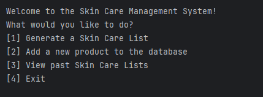

# SkinCareList

## About the Project

  

## Features
Prior to using the Skin Care List Generator ensure you have downloaded all files properly:
- Ensure you have a total of six (6) files
- Upon running the Main class you should be presented with a Command Line Interface

## Main Features
- Skin Care List Generator (based on the number of steps you desire)
- Print list in 'Receipt' form
- Add new Product (allows you to add a new product to the databse)
- View Past Lists (view all previously saved lists)

### List Generator

  

#### Randomly Generated List

  

#### Switch Products In/Out

  

  

### Print List

  

#### Save List?

  

### Add new Product

  

#### Enter Information

  

#### Confirmation

  

### View Past Lists

  

## Built Using
- Java
- IntelliJ
